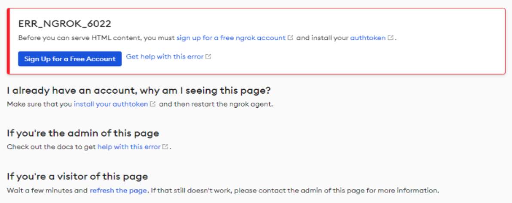

# Query Org User with Message Extension SSO
This is a simple search-based message extension app demonstrating how to integrate with Bot Framework SDK, TeamsFx SDK and Microsoft Graph API to implement a feature that queries organization's user with single sign on (SSO) capability.
## Prerequisites

- [NodeJS](https://nodejs.org/en/), fully tested on NodeJS 14, 16
- A Microsoft 365 account. If you do not have Microsoft 365 account, apply one from [Microsoft 365 developer program](https://developer.microsoft.com/en-us/microsoft-365/dev-program)
- [Teams Toolkit Visual Studio Code Extension](https://aka.ms/teams-toolkit) or [TeamsFx CLI](https://aka.ms/teamsfx-cli)

## Debug
Clone this repo, navigate to QueryYourOrgUserWithMeSSO/ folder, start debugging the project by hitting the F5 key in Visual Studio Code. Alternatively use the `Run and Debug Activity Panel` in Visual Studio Code and click the `Start Debugging` green arrow button.

If you encounter the ngrok page below when sending the `show` command to the bot, please follow the steps to solve this issue.

1. Stop debugging in Visual Studio Code.
2. Sign up an ngrok account in https://dashboard.ngrok.com/signup.
3. Copy your personal ngrok authtoken from https://dashboard.ngrok.com/get-started/your-authtoken.
4. Run `npx ngrok authtoken <your-personal-ngrok-authtoken>` in Visual Studio Code terminal.
5. Start debugging the project again by hitting the F5 key in Visual Studio Code.

