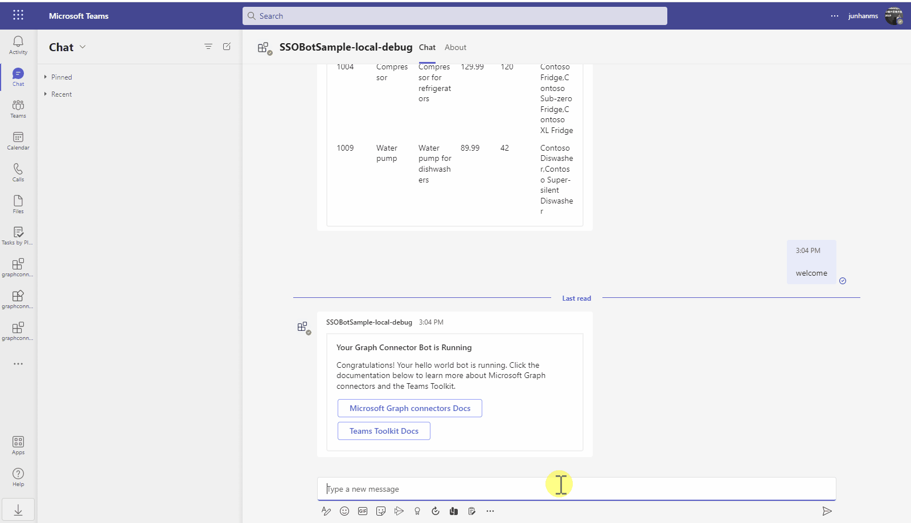
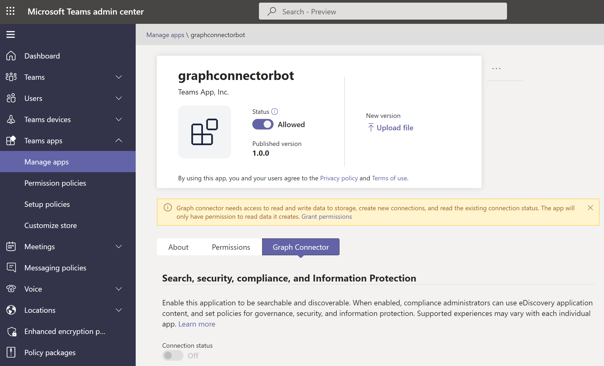
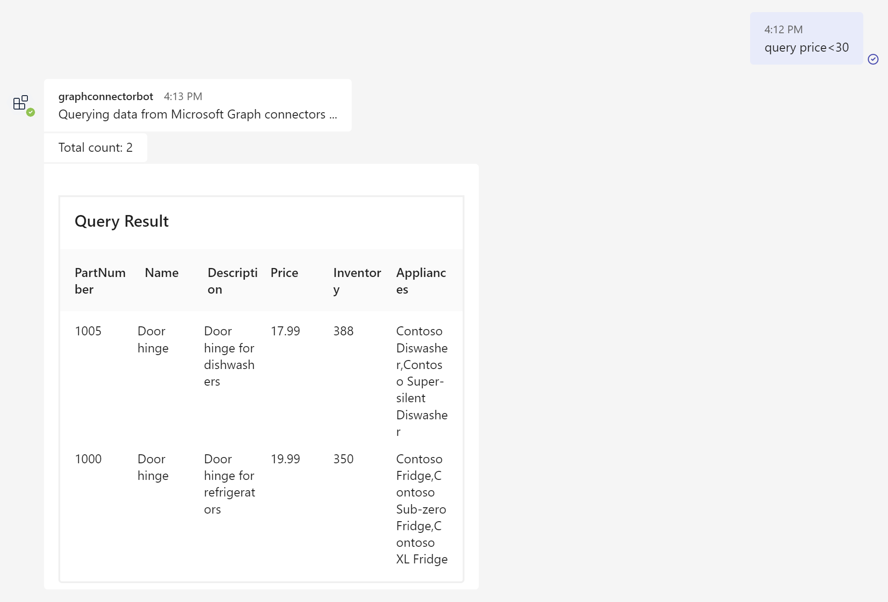
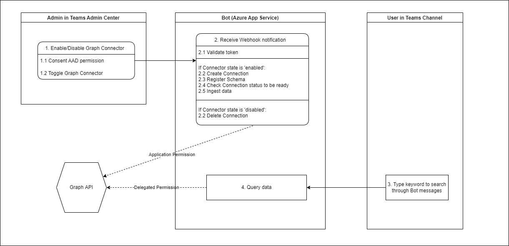

# Getting Started with Graph Connector Bot Sample

This sample app showcases how to build a Teams command bot that queries custom data ingested into Microsoft Graph using Graph connector.

## Prerequisites
- [NodeJS](https://nodejs.org/en/), fully tested on NodeJS 14, 16
- An [Azure subscription](https://azure.microsoft.com/en-us/free/)
- An Microsoft 365 account with admin permission. If you do not have M365 account, apply one from [M365 developer program](https://developer.microsoft.com/en-us/microsoft-365/dev-program)

## What you will learn in this sample:
- How to handle webhook notification when Graph connector is turned on or off in Teams Admin Center.
- How to use Microsoft Graph API to integrate with Microsoft Graph connector.
- How to use TeamsFx SDK to build bot to query data from Microsoft Graph connector.

## Try the Sample with Visual Studio Code Extension:

### Local Debug the Sample
1. Clone the repo to your local workspace or directly download the source code.
1. Download [Visual Studio Code](https://code.visualstudio.com) and install [Teams Toolkit Visual Studio Code Extension](https://aka.ms/teams-toolkit).
1. Open the project in Visual Studio Code.
1. Open Debug View (`Ctrl+Shift+D`) and select "Debug (Edge)" or "Debug (Chrome)" in dropdown list.
1. Press "F5" to open a browser window and then select your package to view sample app. 
1. Find the Teams package in `build\appPackage\appPackage.local.zip`.
1. Navigate to [Teams Admin Center](https://admin.teams.microsoft.com/policies/manage-apps), and upload the Teams package.
    > **Note**: If you are testing in a new debug session again, you need to delete the existing Teams app in Teams Admin Center and upload a new one, since the ngrok endpoint will change when you start a new debug session.

### (Optional) Provision and Deploy the Sample to Azure
> If you don't have an Azure subscription, create [a free account](https://azure.microsoft.com/en-us/free/) before you begin
1. Open the command palette and select `Teams: Provision in the cloud`. You will be asked to select Azure resource group to provision the sample.
1. Once provision is completed, open the command palette and select `Teams: Deploy to the cloud`.
1. Once deployment is completed, you can preview the APP running in Azure. In Visual Studio Code, open `Run and Debug` and select `Launch Remote (Edge)` or `Launch Remote (Chrome)` in the dropdown list and Press `F5` or green arrow button to open a browser.
1. Use Teams Toolkit to [submit the Teams app to the Teams Admin Center](https://docs.microsoft.com/en-us/microsoftteams/platform/toolkit/publish#publish-to-your-organization).
1. [Approve the Teams app for publishing to your organization's app store](https://docs.microsoft.com/en-us/microsoftteams/platform/toolkit/publish#admin-approval-for-teams-apps).

## Use the app in Teams
1. Navigate to 'Graph Connector' section of the Teams app in [Teams Admin Center](https://admin.teams.microsoft.com/policies/manage-apps), and click 'Grant permissions'.

    

1. Wait for connection status to be ready.

    > **Note**: It may take about several minutes.

    

1. In Teams, type `query <query string>` in bot conversation to query data from Graph connector.

    

1. In 'Graph Connector' section of Teams Admin Center, you could toggle the 'Connection status' to turn off Graph connector, then the connection will be deleted.

## Architecture

### Code structure

- You can check app configuration in `teamsapp.*.yml` files
- You can check app environment information in: [env](env)
- You will find bot code in: [bot/commands/](bot/commands/)
- You will find backend services code in: [bot/services/](bot/services/)

## Code of Conduct
This project has adopted the [Microsoft Open Source Code of Conduct](https://opensource.microsoft.com/codeofconduct/).

For more information see the [Code of Conduct FAQ](https://opensource.microsoft.com/codeofconduct/faq/) or
contact [opencode@microsoft.com](mailto:opencode@microsoft.com) with any additional questions or comments.