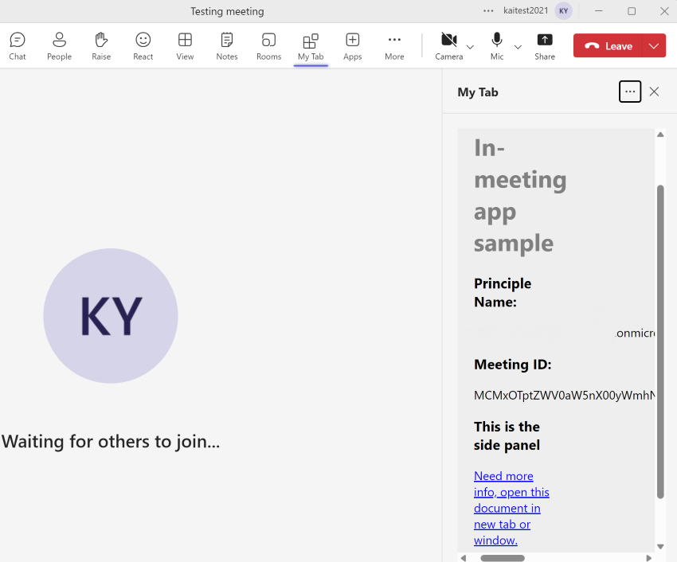

# Getting Started with HelloWorld In-meeting app

This App helps to enable your apps for Teams meetings and configure the apps to be available in the meeting scope. This app covers show Teams context in meeting detail view, chat view and side panel.

> App Caching was configured in this sample to reduce the reload time of your app in a meeting. To learn about limitations and available scopes, please check [Enable app caching for your tab app](https://aka.ms/teamsfx-app-caching).

## This sample illustrates

- How to use Teams Toolkit to create a Teams meeting app.
- How to use Teams Client Library to get context data in Teams app.

## Prerequisite to use this sample

- [Node.js](https://nodejs.org/), supported versions: 16, 18
- A Microsoft 365 tenant in which you have permission to upload Teams apps. You can get a free Microsoft 365 developer tenant by joining the [Microsoft 365 developer program](https://developer.microsoft.com/en-us/microsoft-365/dev-program).
- [Teams Toolkit Visual Studio Code Extension](https://aka.ms/teams-toolkit) version 5.0.0 and higher or [TeamsFx CLI](https://aka.ms/teamsfx-cli)
- Follow the instruction to [create a meeting in Teams](https://support.microsoft.com/en-us/office/create-a-meeting-in-teams-for-personal-and-small-business-use-eb571219-517b-49bf-afe1-4fff091efa85). Then in the Calendar you can find the meeting you just created. Double click the meeting will open the meeting details, and will enable the meeting app to be added in this meeting in later steps.

## Minimal path to awesome

### Run the app locally

1. In Visual Studio Code: Start debugging the project by hitting the `F5` key in your keyboard. Alternatively open the `Run and Debug Activity` panel(Ctrl+Shift+D) in Visual Studio Code and click the `Run and Debug` green arrow button.
1. The Teams web client will launch in your browser, click the small arrow sit aside the `Add` button and select `Add to a meeting`, then select the meeting you just created.
1. Click `Set up a tab` in the next step, it will take you to the meeting configuration page.
1. In the configuration page, click `Save`, this may take several minutes, and then you will see the meeting chat tab.
1. Click `Join` to join the meeting.
1. Select the tab (default name is `My Tab`) in the bar, you will see a side panel tab in the meeting.

### Deploy the app to Azure

Deploy your project to Azure by following these steps:

1. Open Teams Toolkit in Visual Studio Code, and sign in your Azure account by clicking the `Sign in to Azure` in the `ACCOUNTS` section from sidebar.
1. After you signed in, select a subscription under your account. The Teams Toolkit will use this subscription to provision Azure resources to host you app.
1. Open the Teams Toolkit and click `Provision` in the `LIFECYCLE` section. Alternatively open the command palette(Ctrl+Shift+P) and type: `Teams: Provision` command.
1. Open the Teams Toolkit and click `Deploy` in the `LIFECYCLE` section. Alternatively open the command palette(Ctrl+Shift+P) and type: `Teams: Deploy` command.

> Note: Provision Azure cloud resources and deploy to Azure may cause charges to your Azure Subscription.

### Preview the app in Teams

After you have completed the provision and deploy steps in `Deploy the app to Azure` section, you can preview your app in Teams client by following steps below:

1. Open the `Run and Debug Activity` panel from sidebar, or use short key Ctrl+Shift+D.
1. Select `Launch Remote (Edge)` or `Launch Remote (Chrome)` in the launch configuration (a dropdown selection in the upper-left corner).
1. Press the `Start Debugging` (small green arrow) button to launch your app, the Teams web client will be automatically opened in your browser, where you will see your app running remotely from Azure.

## Version History

| Date         | Author | Comments                               |
| ------------ | ------ | -------------------------------------- |
| Dec 15, 2022 | Kai    | update to support Teams Toolkit V4.2.0 |
| Mar 16, 2023 | Kai    | update to support Teams Toolkit V5.0.0 |

## Feedback

We really appreciate your feedback! If you encounter any issue or error, please report issues to us following the [Supporting Guide](https://github.com/OfficeDev/TeamsFx-Samples/blob/dev/SUPPORT.md). Meanwhile you can make [recording](https://aka.ms/teamsfx-record) of your journey with our product, they really make the product better. Thank you!
