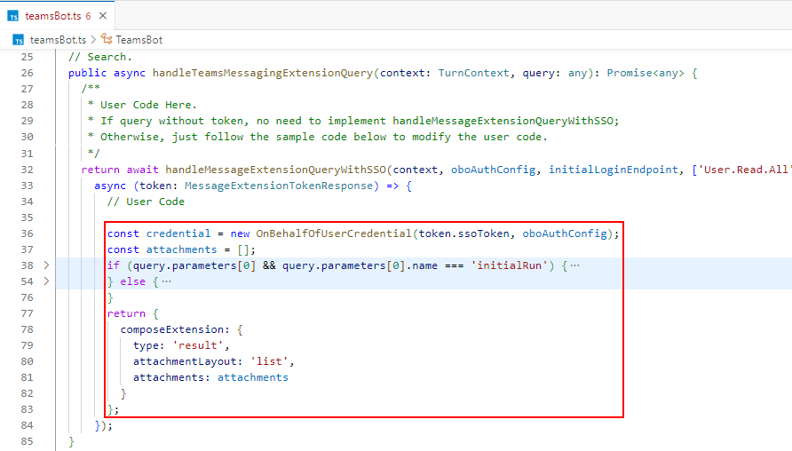

# Query Org User with Message Extension SSO
This is a simple search-based message extension app demonstrating how to integrate with Bot Framework SDK, TeamsFx SDK and Microsoft Graph API to implement a feature that queries organization's user with single sign on (SSO) capability.
## Prerequisites

- [NodeJS](https://nodejs.org/en/), fully tested on NodeJS 14, 16
- A Microsoft 365 account. If you do not have Microsoft 365 account, apply one from [Microsoft 365 developer program](https://developer.microsoft.com/en-us/microsoft-365/dev-program)
- [Teams Toolkit Visual Studio Code Extension](https://aka.ms/teams-toolkit) or [TeamsFx CLI](https://aka.ms/teamsfx-cli)

## What you will learn in this sample
- How to login and consent in Message Extension
- How to use Microsoft Graph API to do query with SSO token in Message Extension

## Try the Sample with Visual Studio Code Extension
### Local Debug the Sample
1. Clone the repo to your local workspace or directly download the source code.
2. Download [Visual Studio Code](https://code.visualstudio.com/) and install [Teams Toolkit Visual Studio Code Extension](https://marketplace.visualstudio.com/items?itemName=TeamsDevApp.ms-teams-vscode-extension).
3. Open the project in Visual Studio Code.
4. Open Debug View (`Ctrl+Shift+D`) and select "Debug(Edge)" or "Debug(Chrome)" in dropdown list.
5. Press "F5" finnaly pop up an window to login your tennant account, and install this Teams App.

### (Optional) Provision and Deploy the Sample To Azure
> If you don't have an Azure subscription, create [a free account](https://azure.microsoft.com/en-us/free/) before you begin
1. Open the command palette and select `Teams: Provision in the cloud`. You will be asked to select Azure resource group to provision the sample.
2. Once provision is completed, open the command palette and select `Teams: Deploy to the cloud`.
3. Once deployment is completed, you can preview the APP running in Azure. In Visual Studio Code, open `Run and Debug` and select `Launch Remote(Edge)` or `Launch Remote(Chrome)` in the dropdown list and Press `F5` or green arrow button to open a browser.

## Use the APP in Teams
1. Select the `QueryOrgUserWithMESSO` message extension from the More options(...) button in the compose box. The APP will look like this when it runs for the first time.

2. For the first time to run the App, you need to Sign In the APP and consent to use Microsoft Graph API. Click on "Accept" button to accept the Authorization.

3. Once consented, the App will show your profile like this.

4. Then you can search your team member names and the App list the result.

5. Select the result and send the card.

### Custom the Query Logic
- Follow the code in `bot/teamsBot.ts`, custom your query logic in `handleMessageExtensionQueryWithToken`.

- Update the scopes in `./templates/appPackages/aad.template.json` which used by your Graph Client.

- If you want to see the updated results, please re-run local debug, or re-provision to update the AAD app and re-deploy the changed part.

### Handle ERR_NGROK_6022 Error
> If you encounter the ngrok page below when sending the `show` command to the bot, please follow the steps to solve this issue.

1. Stop debugging in Visual Studio Code.
2. Sign up an ngrok account in https://dashboard.ngrok.com/signup.
3. Copy your personal ngrok authtoken from https://dashboard.ngrok.com/get-started/your-authtoken.
4. Run `npx ngrok authtoken <your-personal-ngrok-authtoken>` in Visual Studio Code terminal.
5. Start debugging the project again by hitting the F5 key in Visual Studio Code.

## Further reading
- [Bot Basics](https://docs.microsoft.com/azure/bot-service/bot-builder-basics?view=azure-bot-service-4.0)
- [Add Authentication to Message Extension](https://docs.microsoft.com/en-us/microsoftteams/platform/messaging-extensions/how-to/add-authentication)
- [Message Extension SSO](https://docs.microsoft.com/en-us/microsoftteams/platform/messaging-extensions/how-to/enable-sso-auth-me)