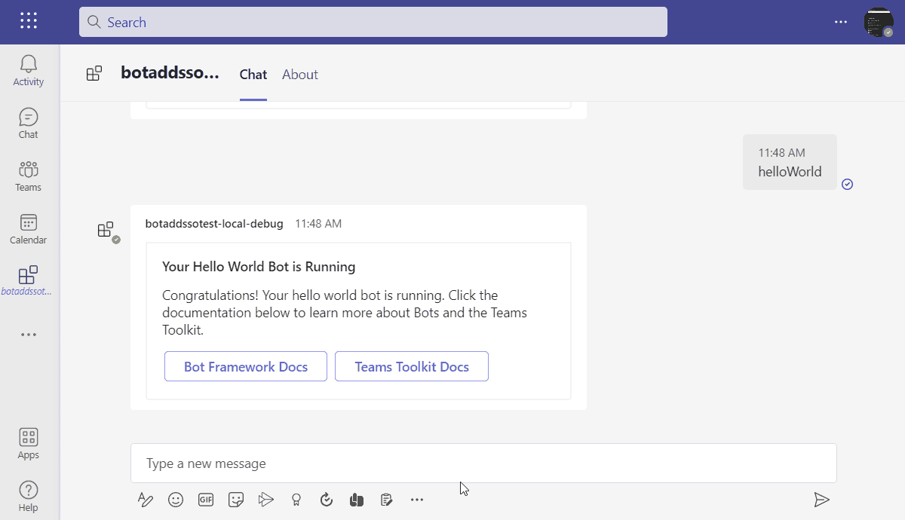

# Build Bots for Teams

A bot, chatbot, or conversational bot is an app that responds to simple commands sent in chat and replies in meaningful ways. Examples of bots in everyday use include: bots that notify about build failures, bots that provide information about the weather or bus schedules, or provide travel information. A bot interaction can be a quick question and answer, or it can be a complex conversation. Being a cloud application, a bot can provide valuable and secure access to cloud services and corporate resources.

This is a command response bot sample using TeamsFx SDK support both sso and non-sso commands, and the commands can be found as below:
| command | response | sso command |
| - | - | - |
| helloworld | helloworld adaptive card message | false |
| profile | user profile information from Microsoft Graph API | true |
| photo | user photo image from Microsoft Graph API| true |

## Prerequisites

- [NodeJS](https://nodejs.org/en/), fully tested on NodeJS 14, 16
- A Microsoft 365 account. If you do not have Microsoft 365 account, apply one from [Microsoft 365 developer program](https://developer.microsoft.com/en-us/microsoft-365/dev-program)
- [Teams Toolkit Visual Studio Code Extension](https://aka.ms/teams-toolkit) or [TeamsFx CLI](https://aka.ms/teamsfx-cli)

## Debug

Clone this repo, navigate to `sso-command-bot/` folder. Start debugging the project by hitting the `F5` key in Visual Studio Code. Alternatively use the `Run and Debug Activity Panel` in Visual Studio Code and click the `Start Debugging` green arrow button.

If you encounter the ngrok page below when sending the `profile` command to the bot, please follow the steps to solve this issue.

1. Stop debugging in Visual Studio Code.
2. Sign up an ngrok account in https://dashboard.ngrok.com/signup.
3. Copy your personal ngrok authtoken from https://dashboard.ngrok.com/get-started/your-authtoken.
4. Run `npx ngrok authtoken <your-personal-ngrok-authtoken>` in Visual Studio Code terminal.
5. Start debugging the project again by hitting the F5 key in Visual Studio Code.

## Edit the manifest

You can find the Teams manifest in `templates/appPackage/manifest.template.json`. It contains template arguments with `{...}` statements which will be replaced at build time. You may add any extra properties or permissions you require to this file. See the [schema reference](https://docs.microsoft.com/en-us/microsoftteams/platform/resources/schema/manifest-schema) for more.

## Edit Azure AD manifest

You can find the Azure AD manifest in `templates/appPackage/aad.template.json`, and this file can help you manage Azure AD app for SSO. Follow this [document](https://docs.microsoft.com/en-us/microsoftteams/platform/toolkit/aad-manifest-customization) to update Azure AD manifest if you want to customize AD app.

## Deploy to Azure

Deploy your project to Azure by following these steps:

| From Visual Studio Code | Using TeamsFx CLI |
| :- | :- |
| <ul><li>Open Teams Toolkit, and sign into Azure by clicking the `Sign in to Azure` under the `ACCOUNTS` section from sidebar.</li> <li>After you signed in, select a subscription under your account.</li><li>Open the command palette and select: `Teams: Provision in the cloud`.</li><li>Open the command palette and select: `Teams: Deploy to the cloud`.</li></ul> | <ul> <li>Run command `teamsfx account login azure`.</li> <li>Run command `teamsfx account set --subscription <your-subscription-id>`.</li> <li> Run command `teamsfx provision`.</li> <li>Run command: `teamsfx deploy`. </li></ul> |

> Note: Provisioning and deployment may incur charges to your Azure Subscription.

## Preview

Once the provisioning and deployment steps are finished, you can preview your app:

1. From Visual Studio Code, open the `Run and Debug Activity Panel`.
1. Select `Launch Remote (Edge)` or `Launch Remote (Chrome)` from the launch configuration drop-down.
1. Press the Play (green arrow) button to launch your app - now running remotely from Azure.

## Validate manifest file

To check that your manifest file is valid:

- From Visual Studio Code: open the command palette and select: `Teams: Validate manifest file`.
- From TeamsFx CLI: run command `teamsfx validate` in your project directory.

## Build

- From Visual Studio Code: open the command palette and select `Teams: Zip Teams metadata package`.
- Alternatively, from the command line run `teamsfx build` in the project directory.

## Publish to Teams

Once deployed, you may want to distribute your application to your organization's internal app store in Teams. Your app will be submitted for admin approval.

- From Visual Studio Code: open the command palette and select: `Teams: Publish to Teams`.
- From TeamsFx CLI: run command `teamsfx publish` in your project directory.

## Further reading

- [Bot Basics](https://docs.microsoft.com/azure/bot-service/bot-builder-basics?view=azure-bot-service-4.0)
- [Bot Framework Documentation](https://docs.botframework.com/)
- [Azure Bot Service Introduction](https://docs.microsoft.com/azure/bot-service/bot-service-overview-introduction?view=azure-bot-service-4.0)
- [Single sign-on (SSO) support for bots](https://docs.microsoft.com/en-us/microsoftteams/platform/bots/how-to/authentication/auth-aad-sso-bots#:~:text=%20Develop%20an%20SSO%20Teams%20bot%20%201,token%20is%20a%20normal%20POST%20message...%20More%20)
- [Dialogs in the Bot Framework SDK](https://docs.microsoft.com/en-us/azure/bot-service/bot-builder-concept-dialog?view=azure-bot-service-4.0)
