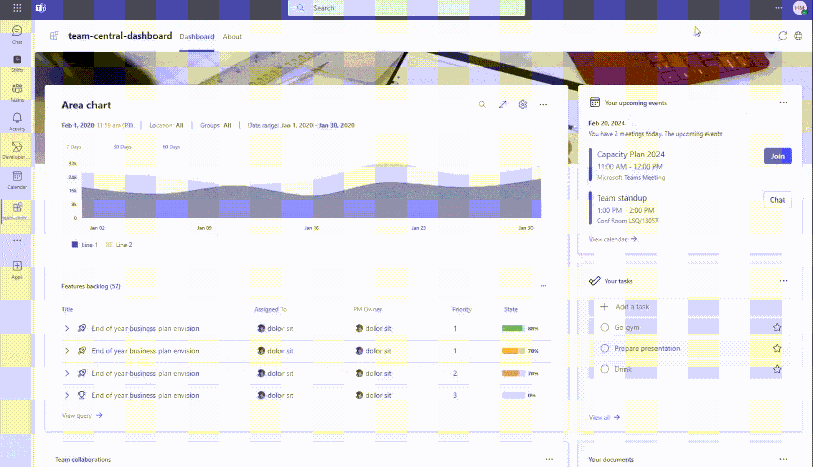

# Getting Started with Team Central Dashboard

Microsoft Teams supports the ability to run web-based UI inside "custom tabs" that users can install either for just themselves (personal tabs) or within a team or group chat context.

Team Central Dashboard shows you how to build a tab with data chats and content from Microsoft Graph to accelerate team collaboration and personal productivity.

> Note: This sample will only provision [single tenant](https://learn.microsoft.com/azure/active-directory/develop/single-and-multi-tenant-apps#who-can-sign-in-to-your-app) Azure Active Directory app. For multi-tenant support, please refer to this [wiki](https://aka.ms/teamsfx-multi-tenant).

## This sample illustrates

- How to use TeamsFx to embed a canvas containing multiple cards that provide an overview of data or content in your tab app.
- How to use TeamsFx to build frontend hosting on Azure for your tab app.
- How to use TeamsFx to build backend hosting on Azure for your tab app.
- How to use MS graph client in TeamsFx to get access to M365 data.

## Prerequisite to use this sample

- [Node.js](https://nodejs.org/), supported versions: 16, 18
- A Microsoft 365 tenant in which you have permission to upload Teams apps. You can get a free Microsoft 365 developer tenant by joining the [M365 developer program](https://developer.microsoft.com/en-us/microsoft-365/dev-program)
- [Teams Toolkit Visual Studio Code Extension](https://aka.ms/teams-toolkit) version 5.0.0 and higher or [TeamsFx CLI](https://aka.ms/teamsfx-cli)

## Minimal path to awesome

> Here are the instructions to run the sample in **Visual Studio Code**. You can also try to run the app using TeamsFx CLI tool, refer to [Try the Sample with TeamsFx CLI](cli.md)

### Run the app locally

1. Clone the repo to your local workspace or directly download the source code.
1. Open the project in Visual Studio Code.
1. Start debugging the project by hitting the `F5` key in Visual Studio Code.

> The first time you run this sample, you need to login to consent some delegated permissions. If you don't see the consent page, please check if your browser blocks the pop-up window.
> 

### Deploy the app to Azure

Deploy your project to Azure by following these steps:

1. Open Teams Toolkit in Visual Studio Code, and sign in your Azure account by clicking the `Sign in to Azure` in the `ACCOUNTS` section from sidebar.
1. After you signed in, select a subscription under your account. The Teams Toolkit will use this subscription to provision Azure resources to host you app.
1. Open the Teams Toolkit and click `Provision` in the `LIFECYCLE` section. Alternatively open the command palette(Ctrl+Shift+P) and type: `Teams: Provision` command.
1. Open the Teams Toolkit and click `Deploy` in the `LIFECYCLE` section. Alternatively open the command palette(Ctrl+Shift+P) and type: `Teams: Deploy` command.

> Note: Provision Azure cloud resources and deploy to Azure may cause charges to your Azure Subscription.

### Preview the app in Teams

After you have completed the provision and deploy steps in `Deploy the app to Azure` section, you can preview your app in Teams client by following steps below:

1. Open the `Run and Debug Activity` panel from sidebar, or use short key Ctrl+Shift+D.
1. Select `Launch Remote (Edge)` or `Launch Remote (Chrome)` in the launch configuration (a dropdown selection in the upper-left corner).
1. Press the `Start Debugging` button to launch your app, the Teams web client will be automatically opened in your browser, where you will see your app running remotely from Azure.

## Advanced usage of this sample

### Area Chart

This widget displays a chart and a table with dummy data. You can select a date range to filter the data.

### Team Collaboration

This widget displays some collaboration cards with dummy data.

### Your upcoming events

This widget displays the upcoming events on your calendar. You can click the `Join` button to join a meeting, and click the `View calendar` button to open your calendar app.

### Your tasks

This widget displays your to-do tasks. Your can input a task name and click the `Add` button to add a new task. You also can click the `View all` button to open your task app.

> To receive notifications in Microsoft Teams, you will need to consent certain permissions. Please refer to the following steps after you have run the provision or local debug at least once.
>
> Go to [Azure portal](https://portal.azure.com/) > Click `Azure Active Directory` > Click `App registrations` in the side bar > Click your Dashboard app > Click `API permissions` in the side bar > Click `+Add a permission` > Choose `Microsoft Graph` > Choose `Application permissions` > Find the two permissions `TeamsActivity.Send` and `TeamsAppInstallation.ReadForUser.All` > Click `Add permissions` button in the bottom > Click `✔Grant admin consent for XXX` and then click `Yes` button to finish the admin consent > Re-provision or re-run local debug.

### Your documents

This widget displays your content files in OneDrive. You can click one to open it. You can also click the `...` button on the right to choose the way to open the file, download the file or copy the file link.

## Known issues

In mobile devices, the feature of open in Teams may not work.

## Version History

| Date         | Author     | Comments                               |
| ------------ | ---------- | -------------------------------------- |
| Feb 22, 2023 | Hui, Frank | onboard                                |
| Mar 31, 2023 | Hui        | update to support Teams Toolkit V5.0.0 |

## Feedback

We really appreciate your feedback! If you encounter any issue or error, please report issues to us following the [Supporting Guide](https://github.com/OfficeDev/TeamsFx-Samples/blob/dev/SUPPORT.md). Meanwhile you can make [recording](https://aka.ms/teamsfx-record) of your journey with our product, they really make the product better. Thank you!
