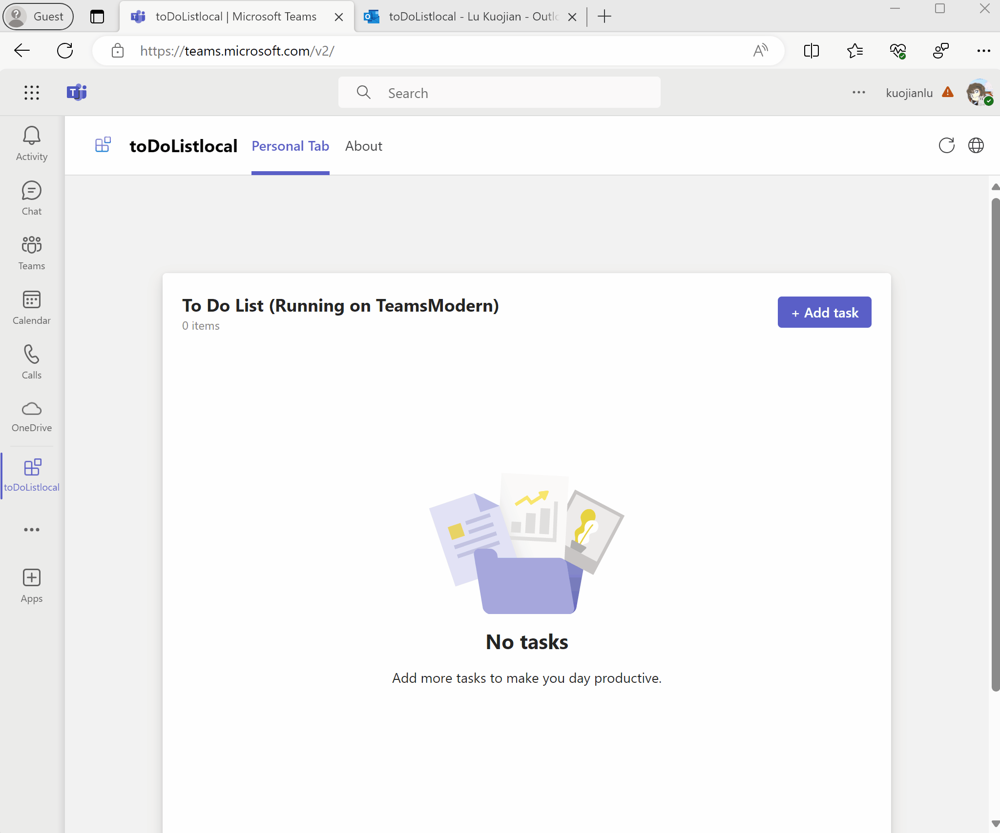

# Getting Started with Todo List
Todo List app helps to manage your personal to do items. This app can be installed and used not only in your Teams client, but also Outlook client and the Microsoft 365 app. The frontend is a React app and the backend is an Azure Function. You can deploy and host the app in Azure.

> Note: This sample will only provision [single tenant](https://learn.microsoft.com/azure/active-directory/develop/single-and-multi-tenant-apps#who-can-sign-in-to-your-app) Azure Active Directory app. For multi-tenant support, please refer to this [wiki](https://aka.ms/teamsfx-multi-tenant).

## This sample illustrates
- How to use Teams Toolkit to build frontend hosting on Azure for your tab app.
- How to use Teams Toolkit to build backend hosting on Azure for your tab app.
- How to use MS graph client in TeamsFx to get access to Microsoft 365 data.
- How to use Teams Toolkit to build a personal tab app with Azure Function backend that runs across Microsoft 365 including Teams, Outlook and the Microsoft 365 app.

## Prerequisite to use this sample
- [Node.js](https://nodejs.org/), supported versions: 16, 18
- An [Azure subscription](https://azure.microsoft.com/en-us/free/)
- [Set up your dev environment for extending Teams apps across Microsoft 365](https://aka.ms/teamsfx-m365-apps-prerequisites)
- [Teams Toolkit Visual Studio Code Extension](https://aka.ms/teams-toolkit) version 5.0.0 and higher or [TeamsFx CLI](https://aka.ms/teamsfx-cli)

## Minimal path to awesome
> Here are the instructions to run the sample in **Visual Studio Code**. You can also try to run the app using TeamsFx CLI tool, refer to [Try the Sample with TeamsFx CLI](cli.md)

### Run the app locally
1. Clone the repo to your local workspace or directly download the source code.
1. Download [Visual Studio Code](https://code.visualstudio.com) and install [Teams Toolkit Visual Studio Code Extension](https://aka.ms/teams-toolkit).
1. Open the project in Visual Studio Code.
1. Open the `Run and Debug` Activity Panel. Select a target Microsoft application where the app runs: `Debug in Teams`, `Debug in Outlook` or `Debug in the Microsoft 365 app`.

### Deploy the app to Azure
1. Open the command palette and select `Teams: Provision`.
1. Once provision is completed, open the command palette and select `Teams: Deploy`.

### Preview the app
1. Once deployment is completed, you can preview the app running in Azure. In Visual Studio Code, open the `Run and Debug` Activity Panel.  Select a target Microsoft application where the app runs: `Launch Remote in Teams`, `Launch Remote in Outlook` or `Launch Remote in the Microsoft 365 app`.

#### Usage of this sample
1. The app will look like this when it runs for the first time.
  
2. For the first time to run the app, you need to consent the app to get your profile information like your avatar. Click on "Accept" button to accept the Authorization.
  
3. You could try to add new todo item by typing item by clicking "Add task" button.
4. You could try to complete todo item by choosing the checkbox before the item.
5. You could try to update todo item by typing text in todo item list.
6. You could try to delete todo item by clicking "..." and then choose "delete" button.

## Version History
|Date| Author| Comments|
|---|---|---|
| Nov 9, 2021 | swatDong | add to support Teams Toolkit v2.10.0 |
| Apr 18, 2022 | kuojianlu | update to support Teams Toolkit v3.8.0 |
| Oct 17, 2022 | swatDong | update to support Teams Toolkit v4.1.0 |
| Mar 28, 2023 | kuojianlu | update to support Teams Toolkit v5.0.0 |

## Feedback
We really appreciate your feedback! If you encounter any issue or error, please report issues to us following the [Supporting Guide](https://github.com/OfficeDev/TeamsFx-Samples/blob/dev/SUPPORT.md). Meanwhile you can make [recording](https://aka.ms/teamsfx-record) of your journey with our product, they really make the product better. Thank you!
